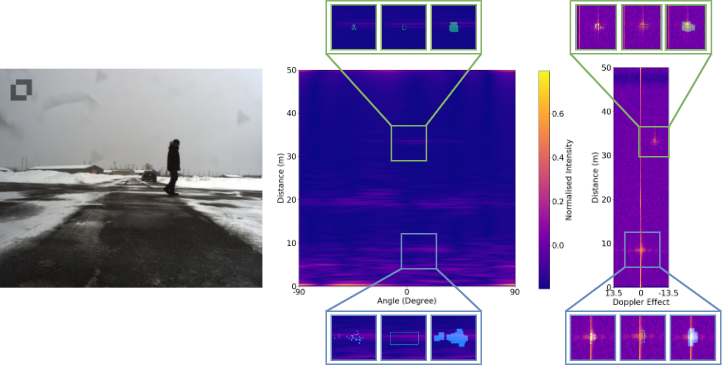

# CARRADA Dataset: Camera and Automotive Radar with Range-Angle-Doppler Annotations

## Paper



[CARRADA Dataset: Camera and Automotive Radar with Range-Angle-Doppler Annotations](https://arxiv.org/abs/2005.01456)

[Arthur Ouaknine](https://arthurouaknine.github.io/), [Alasdair Newson](https://sites.google.com/site/alasdairnewson/), [Julien Rebut](https://scholar.google.com/citations?user=BJcQNcoAAAAJ&hl=fr), [Florence Tupin](https://perso.telecom-paristech.fr/tupin/), [Patrick Pérez](https://ptrckprz.github.io/)

ICPR 2020.

If you find this code or the dataset useful for your research, please cite our [paper](https://arxiv.org/pdf/2005.01456.pdf):
```
@misc{ouaknine2020carrada,
    title={CARRADA Dataset: Camera and Automotive Radar with Range-Angle-Doppler Annotations},
    author={A. Ouaknine and A. Newson and J. Rebut and F. Tupin and P. Pérez},
    year={2020},
    eprint={2005.01456},
    archivePrefix={arXiv},
    primaryClass={cs.CV}
}
```

## Installation with Docker

It is strongly recommanded to use Docker with the provided [Dockerfile](./Dockerfile) containing all the dependencies.

0. Clone the repo:
```bash
$ git clone https://github.com/valeoai/carrada_dataset.git
```

1. Create the Docker image:
```
$ cd carrada_dataset/
$ docker build . -t "carrada_dataset:Dockerfile"
```
**Important note**: The CARRADA dataset will be downloaded and unzipped in the Docker image. Make sure that the Docker user has sufficent rights and has around 80GB of available space on its hard drive. The allocated space to an image can be modified using the option `--memory="100g"`.

2. Run a container and join an interactive session, you will be able to run the code and the tests on this session:
```
$ docker run -d -it --name containername carrada_dataset:Dockerfile sleep infinity
$ docker exec -it containername bash
```


## Installation without Docker

You can either use Docker with the provided [Dockerfile](./Dockerfile) containing all the dependencies, or follow these steps.

0. Clone the repo:
```bash
$ git clone https://github.com/valeoai/carrada_dataset.git
```

1. Install this repository and the dependencies using pip and conda:
```bash
$ cd carrada_dataset/
$ pip install -e .
```
With this, you can edit the carrada_dataset code on the fly and import function and classes of carrada_dataset in other project as well.

2. Install OpenCV if you don't already have it:
```bash
$ conda install -c menpo opencv
```

3. Install all the dependencies using pip, please take a look at the [Dockerfile](./Dockerfile) for the list and versions of the dependencies. 

4. Optional. To uninstall this package, run:
```bash
$ pip uninstall carrada_dataset
```

You can take a look at the [Dockerfile](./Dockerfile) if you are uncertain about steps to install this project.


## Download the CARRADA dataset

If you are using Docker, the downloading and extraction of the dataset is already contained in the Dockerfile.

Otherwise, the dataset is available on Arthur Ouaknine's personal web page using this link: [https://arthurouaknine.github.io/codeanddata/carrada](https://arthurouaknine.github.io/codeanddata/carrada)

**Importante note**: the Carrada.tar.gz file is 8.4GB but once it is extracted, the dataset is around 71.6GB. Please be sure you have at least 80GB avalaible on your hard drive.

The CARRADA dataset contains the camera images, the raw radar data and the generated annotations. A `README.md` file in the dataset provides details about all the files. It is not mandatory to run the entire pipeline to obtain the annotations.

A second release of the CARRADA dataset with full raw RAD tensors for every sequence is planned.


## Generate annotations:

The annotation generation pipeline is composed of 4 blocks:
- generate and track instances using images,
- generate range-Doppler points from the segmented instance,
- generate and track instances in the DoA-Doppler representation,
- generate the annotation files.

1. **Run the entire pipeline**:

It is mandatory to specify the path where the CARRADA dataset is located. Example: I put the `Carrada` folder in `/datasets/`, the path I should specify is `/datasets/`. If you are using Docker, the CARRADA dataset is extracted in the `/datasets/` folder by default.
```bash
$ cd scripts/
$ bash run_annotation_pipeline.sh /datasets/
```

2. **Run the blocks independently**:

If the user didn't set the path to the `Carrada` folder yet, the following lines must be executed:
```bash
$ cd carrada_dataset/scripts/
$ python set_path.py /datasets/
```
Then, each script can be executed independently. Note that each step generates mandatory data for the next one, it is important to keep the pipeline order if the user doesn't have the intermediate data. All intermediate data are provided in the CARRADA dataset, thus the user is able to run any step if the data are downloaded correctly.
```bash
$ cd scripts/
$ python name_of_the_script.py
```


## Tests

Tests have been implemented to ensure the consistency of the pipeline.

1. **Run all the tests**:

It is mandatory to specify the path where the CARRADA dataset is located. Example: I put the `Carrada` folder in `/datasets/`, the path I should specify is `/datasets/`. If you are using Docker, the CARRADA dataset is extracted in the `/datasets/` folder by default.
```bash
$ cd tests/
$ bash run_tests.sh /datasets/
```

2. **Run the tests independently**

If the user didn't set the path to the `Carrada` folder yet, the following lines must be executed:
```bash
$ cd carrada_dataset/scripts/
$ python set_path.py /datasets/
```
Then, each test can be executed independently. Note that the script `test_transform_data.py` requires RAD tensors which will be available in a next release.
```bash
$ cd tests/
$ python name_of_the_test.py
```

## Jupyter Notebook
A Jupyter Notebook `visualize_samples.ipynb` is provided to visualize samples of the CARRADA dataset with annotations.
Note that this notebook also uses RAD tensors, please comment or modify the code if necessary.

**Run Jupyter on Docker:** a command line is already written in the [Dockerfile](./Dockerfile) to execute Jupyter on a container. The user should map the port of the container on its local machine using the following command:
```
$ docker run -p 8889:8889 carrada_dataset:Dockerfile
```
The Jupyter interface is then available on your local machine at `localhost:8889`.

## Acknowledgements

- Special thanks to the SensorCortex team which has recorded the data.
- Special thanks for @gabrieldemarmiesse for his valuable technical help.
- Code for Simple Online and Realtime Tracking (SORT) is borrowed from [https://github.com/abewley/sort](https://github.com/abewley/sort)
- Code for Fully Convolutional Network (FCN) baseline is borrowed from [https://github.com/wkentaro/pytorch-fcn](https://github.com/wkentaro/pytorch-fcn)

## Licenses
 - The carrada_dataset repo is released under the [GNU GPL 3.0 license](./LICENSE).
 - The CARRADA dataset is released under the [Creative Commons Attribution-NonCommercial-ShareAlike 4.0 International Public License (“CC BY-NC-SA 4.0”)](https://creativecommons.org/licenses/by-nc-sa/4.0/legalcode).

---

## To-Do List

- [] Migration to Pathlib for multi os support